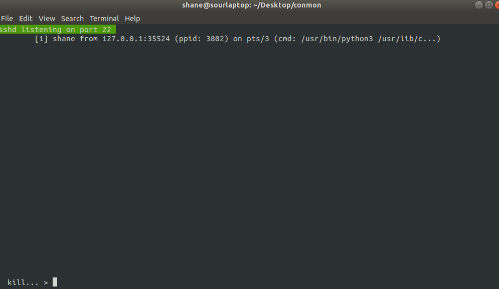

# conmon.sh

WARNING: This project is awful, I'm leaving it up as a testament to how you really can solve everything in bash, but sometimes that's not a good thing.

Connection monitor (conmon). Written in pure bash, only one file (although it uses text files for storage). 

Dependencies:
- bash
- ss (primary network tool)
- dsniff (for tcpkill utility)
- sysdig (for spy_users)
- strace (for reading ssh session data)

k (kill): kill PID and send RST to given IP address for 5 seconds (tcpkill)
b (block, ban): ban IP through iptables command
e (examine): depends on service. gives more detail about connection
h (help): print help
q (quit): quit

### Todo
- fill out all obvious features
- add hide option (in case they're sshing in and dont want to see their own conn)
- use unhide to check for hidden conns
- show weird dns connections to not localhost (and store content of request... pre-emptively? wrapper script for dns reqs?)
- sysdig grep -v conmon processes to avoid clogging it up
- fix too long lines

### Known bugs
- catching ssh when logging in shows inactive once user is logged in (change in recorded PID)
	
### Storage details
- conns.txt --> scratchpad for connection data
- output.txt --> used for referencing data if it changes (conNum pid ip serviceName)
- graveyard.txt --> inactive conns (serviceName timeout pid ip)
- newyard.txt --> temp. storage for old connections
- info.txt --> temp. storage for reporting info

